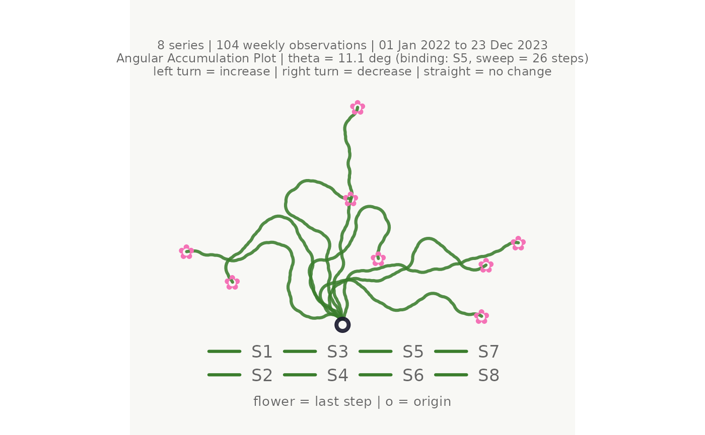
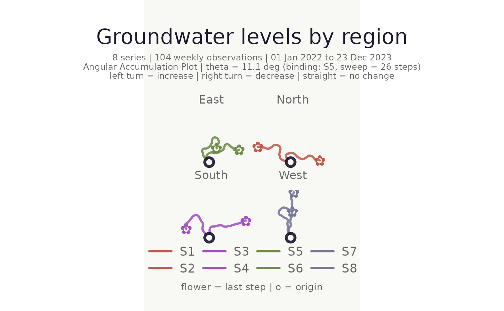
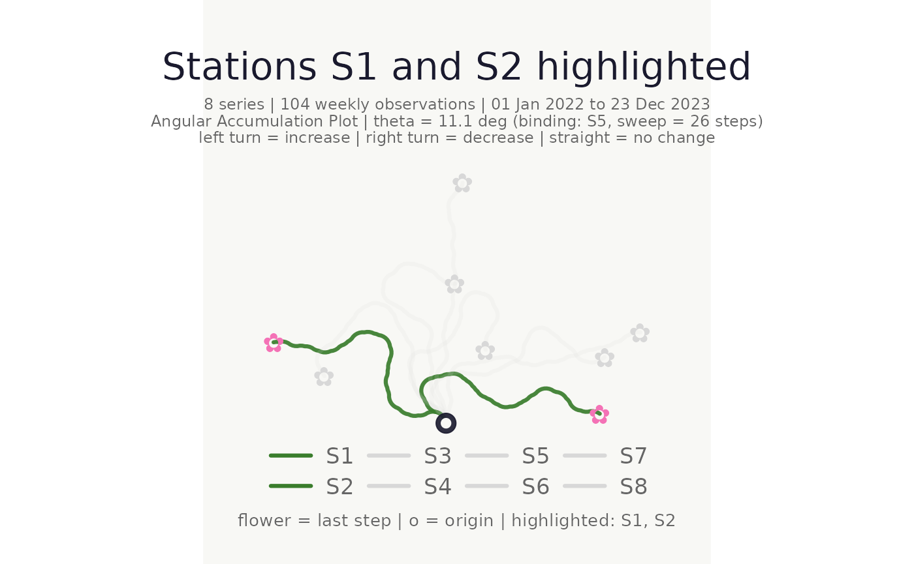
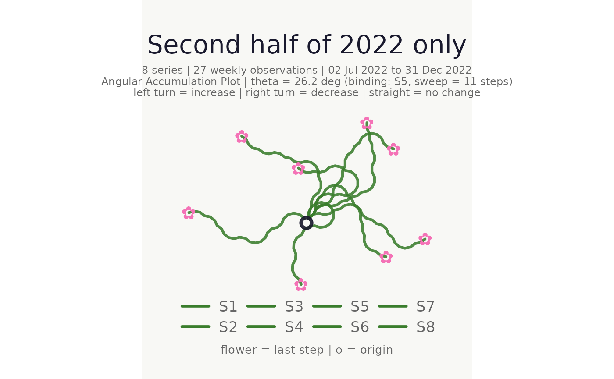
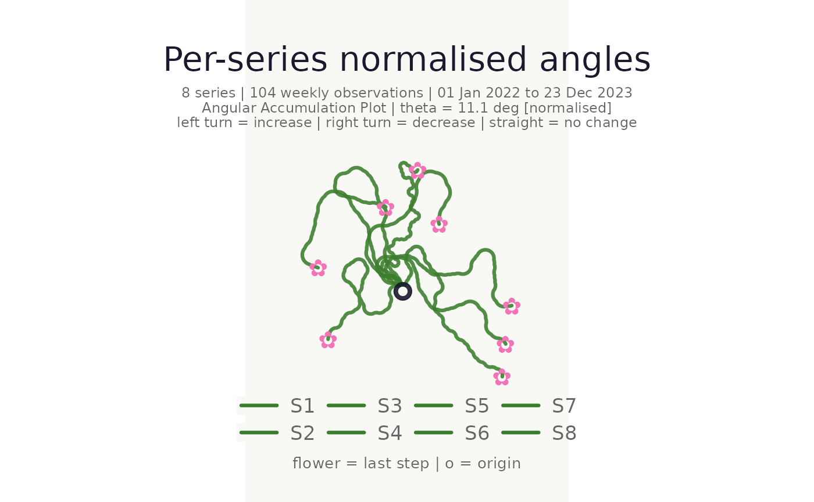
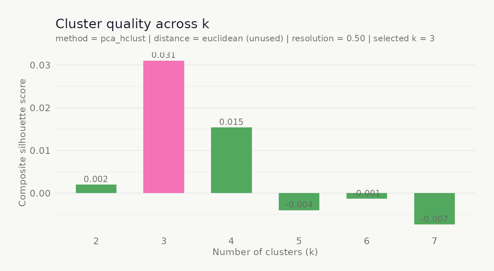
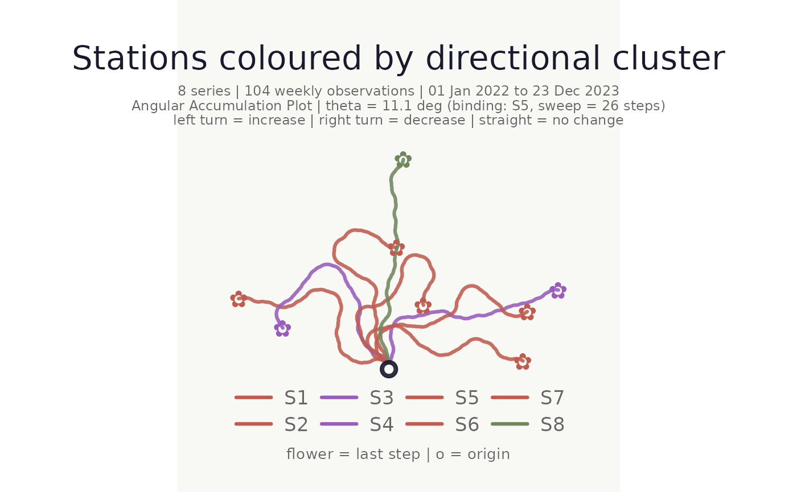
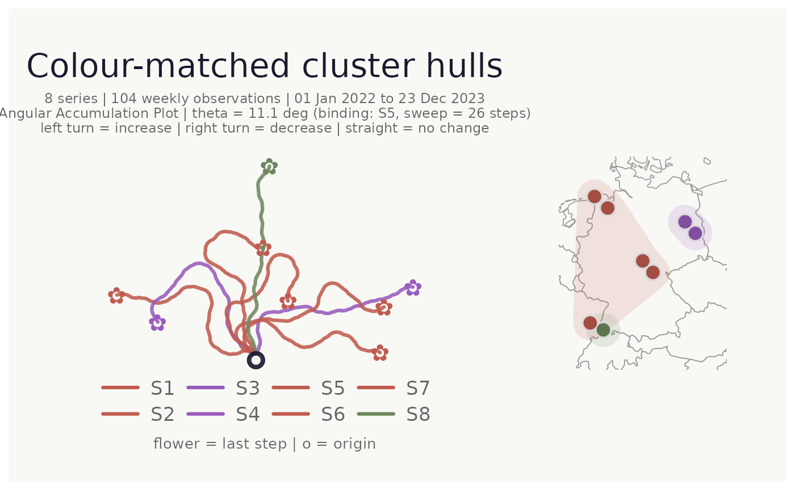
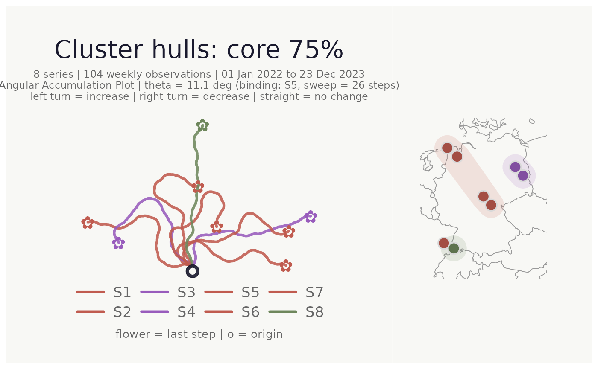

# Getting started with bouquets


## What is a bouquet plot?

An angular accumulation plot encodes each time series as a
turtle-graphics path from a shared origin. At every time step:

- an **increase** turns the heading **left** by θ,
- a **decrease** turns it **right** by θ,
- **no change** goes straight ahead.

Because every series shares the same origin and angle, paths that look
similar belong to series with similar patterns of ups and downs —
regardless of their absolute values. The collection of paths radiates
from the origin like stems in a bouquet.

## Simulated data

Throughout this vignette we use a simulated set of eight groundwater
monitoring stations, each with a weekly time series containing a shared
seasonal signal plus independent noise.

``` r
set.seed(42)
n      <- 104L   # 2 years, weekly
weeks  <- seq(as.Date("2022-01-01"), by = "week", length.out = n)
season <- sin(seq(0, 4 * pi, length.out = n))

gw_long <- tibble::tibble(
  week    = rep(weeks, 8L),
  station = rep(paste0("S", 1:8), each = n),
  region  = rep(c("North", "North", "South", "South",
                  "East",  "East",  "West",  "West"), each = n),
  lon     = rep(c(7.2, 8.1, 13.4, 14.1, 10.5, 11.2, 6.9, 7.8), each = n),
  lat     = rep(c(53.6, 53.1, 52.5, 52.0, 50.8, 50.3, 48.1, 47.8), each = n),
  level_m = c(
    8.5 + 0.9 * season + cumsum(rnorm(n,  0.00, 0.18)),
    8.3 + 0.8 * season + cumsum(rnorm(n,  0.01, 0.20)),
    7.2 + 0.5 * season + cumsum(rnorm(n,  0.02, 0.22)),
    7.0 + 0.6 * season + cumsum(rnorm(n,  0.00, 0.19)),
    9.1 + 1.1 * season + cumsum(rnorm(n, -0.01, 0.15)),
    9.3 + 1.0 * season + cumsum(rnorm(n, -0.02, 0.16)),
    6.8 + 0.3 * season + cumsum(rnorm(n,  0.00, 0.28)),
    7.5 + 0.4 * season + cumsum(rnorm(n,  0.01, 0.25))
  )
)
```

## Minimal plot

The simplest call uses the first three columns as time, series, and
value.

``` r
make_plot_bouquet(
  gw_long,
  time_col   = week,
  series_col = station,
  value_col  = level_m
)
```

    ## <bouquet_plot>  8 series | theta = 11.1 deg | binding: S5



## Colour and faceting

`stem_colors` and `flower_colors` each accept a single hex code, a
vector of hex codes, a keyword (`"greens"` / `"blossom"`), or a bare
column name.

``` r
make_plot_bouquet(
  gw_long,
  time_col      = week,
  series_col    = station,
  value_col     = level_m,
  stem_colors   = region,
  flower_colors = region,
  facet_by      = region,
  title         = "Groundwater levels by region"
)
```

    ## <bouquet_plot>  8 series | theta = 11.1 deg | binding: S5



## Highlighting individual series

Use `highlight` to bring specific series to the foreground; all others
are dimmed to a pale grey.

``` r
make_plot_bouquet(
  gw_long,
  time_col   = week,
  series_col = station,
  value_col  = level_m,
  highlight  = c("S1", "S2"),
  title      = "Stations S1 and S2 highlighted"
)
```

    ## <bouquet_plot>  8 series | theta = 11.1 deg | binding: S5



## Time window filter

Use `from` and `to` to restrict the time range without pre-filtering.

``` r
make_plot_bouquet(
  gw_long,
  time_col   = week,
  series_col = station,
  value_col  = level_m,
  from       = as.Date("2022-07-01"),
  to         = as.Date("2022-12-31"),
  title      = "Second half of 2022 only"
)
```

    ## <bouquet_plot>  8 series | theta = 26.2 deg | binding: S5



## Normalised mode

When `normalise = TRUE` each series receives its own per-series θ so
every path uses the full angular range independently of volatility. This
aids shape comparison across series with very different variances.

``` r
make_plot_bouquet(
  gw_long,
  time_col   = week,
  series_col = station,
  value_col  = level_m,
  normalise  = TRUE,
  title      = "Per-series normalised angles"
)
```

    ## <bouquet_plot>  8 series | theta = 11.1 deg | binding: S5 [normalised]



## Clustering

[`cluster_bouquet()`](https://mxnl.github.io/bouquets/reference/cluster_bouquet.md)
adds a `cluster` column to the data. It returns a `cluster_bouquet`
object: a normal tibble that also carries clustering diagnostics. Call
[`summary()`](https://rdrr.io/r/base/summary.html) to inspect them.

``` r
clustered <- cluster_bouquet(
  gw_long,
  time_col   = week,
  series_col = station,
  value_col  = level_m,
  seed       = 42L
)

summary(clustered)
```

    ## -- cluster_bouquet summary ----------------------------------------------
    ##   Method    : pca_hclust
    ##   Distance  : euclidean (unused)
    ##   Seed      : 42
    ##   Series    : 8   k = 3   Resolution = 0.50
    ##   Mean silhouette : 0.031  (weak structure -- consider more data or fewer clusters)
    ## 
    ##   Auto k selection (composite silhouette score):
    ##     k = 2 : 0.0020
    ##     k = 3 : 0.0311  <-- selected
    ##     k = 4 : 0.0154
    ##     k = 5 : -0.0040
    ##     k = 6 : -0.0013
    ##     k = 7 : -0.0074
    ## 
    ##   Cluster sizes and members:
    ##     C1  (5 series, mean sil = 0.033)
    ##        S1, S2, S5, S6, S7
    ##     C2  (2 series, mean sil = 0.041)
    ##        S3, S4
    ##     C3  (1 series, mean sil = 0.000)
    ##        S8
    ## 
    ##   Per-series silhouette widths:
    ##     S5                    C1   0.062  |
    ##     S6                    C1   0.035  |
    ##     S2                    C1   0.031  |
    ##     S7                    C1   0.029  |
    ##     S1                    C1   0.011  
    ##     S4                    C2   0.075  |
    ##     S3                    C2   0.006  
    ##     S8                    C3   0.000  
    ## ------------------------------------------------------------------------

### Visualise cluster quality

[`plot_cluster_quality()`](https://mxnl.github.io/bouquets/reference/plot_cluster_quality.md)
plots the composite silhouette score across all candidate k values; the
selected k is highlighted in pink.

``` r
plot_cluster_quality(clustered)
```



### Plot coloured and faceted by cluster

The `cluster` column works directly with `stem_colors`, `flower_colors`,
and `facet_by`.

``` r
make_plot_bouquet(
  clustered,
  time_col      = week,
  series_col    = station,
  value_col     = level_m,
  stem_colors   = cluster,
  flower_colors = cluster,
  title         = "Stations coloured by directional cluster"
)
```

    ## <bouquet_plot>  8 series | theta = 11.1 deg | binding: S5



## Location map with cluster hulls

When `lon_col` and `lat_col` are supplied a location map is appended to
the right of the bouquet panel. Pass the cluster column to
`cluster_hull` to draw concave hulls around each cluster’s points. Hull
fill colour automatically matches the cluster’s `flower_colors`.

``` r
make_plot_bouquet(
  clustered,
  time_col      = week,
  series_col    = station,
  value_col     = level_m,
  stem_colors   = cluster,
  flower_colors = cluster,
  lon_col       = lon,
  lat_col       = lat,
  cluster_hull  = cluster,
  title         = "Colour-matched cluster hulls"
)
```

    ## <bouquet_plot>  8 series | theta = 11.1 deg | binding: S5 + map



### Focusing on the cluster core with `hull_coverage`

When clusters are spatially dense or overlap, hulls drawn over all
points can obscure the map. `hull_coverage` (default `1`) restricts the
hull to the fraction of each cluster’s points that lie closest to the
cluster centroid. Setting it to `0.75`, for example, excludes the
outermost 25% of points before computing the hull:

``` r
make_plot_bouquet(
  clustered,
  time_col      = week,
  series_col    = station,
  value_col     = level_m,
  stem_colors   = cluster,
  flower_colors = cluster,
  lon_col       = lon,
  lat_col       = lat,
  cluster_hull  = cluster,
  hull_coverage = 0.75,   # hull covers the innermost 75% of each cluster
  title         = "Cluster hulls: core 75%"
)
```

    ## <bouquet_plot>  8 series | theta = 11.1 deg | binding: S5 + map



## Saving plots

[`save_bouquet()`](https://mxnl.github.io/bouquets/reference/save_bouquet.md)
wraps
[`ggplot2::ggsave()`](https://ggplot2.tidyverse.org/reference/ggsave.html)
with sensible defaults for the bouquet aspect ratio.

``` r
p <- make_plot_bouquet(gw_long, week, station, level_m)
save_bouquet(p, "my_bouquet.png", width = 10, height = 8)
```

## Interactive version

[`make_plot_bouquet_interactive()`](https://mxnl.github.io/bouquets/reference/make_plot_bouquet_interactive.md)
produces a plotly figure with hover tooltips. Requires the `plotly`
package.

``` r
make_plot_bouquet_interactive(gw_long, week, station, level_m)
```

## Full pipeline

A compact end-to-end workflow:

``` r
gw_long |>
  cluster_bouquet(
    time_col   = week,
    series_col = station,
    value_col  = level_m,
    seed       = 42L
  ) |>
  make_plot_bouquet(
    time_col      = week,
    series_col    = station,
    value_col     = level_m,
    stem_colors   = cluster,
    flower_colors = cluster,
    lon_col       = lon,
    lat_col       = lat,
    cluster_hull  = cluster,
    hull_coverage = 0.75,
    title         = "Groundwater directional dynamics"
  )
```
