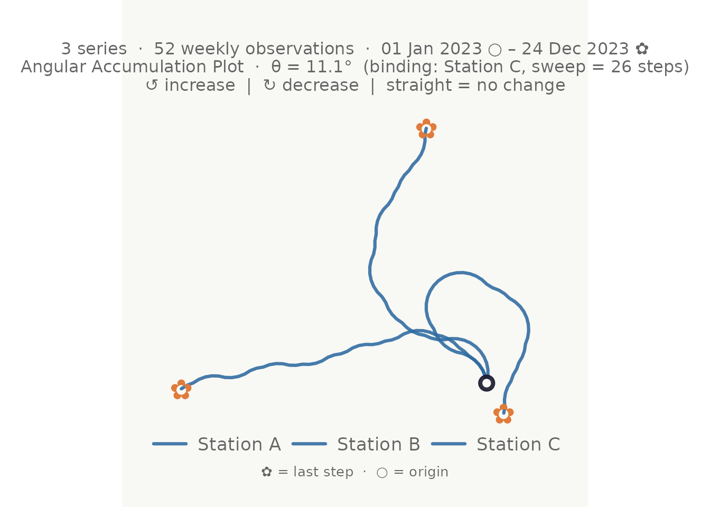
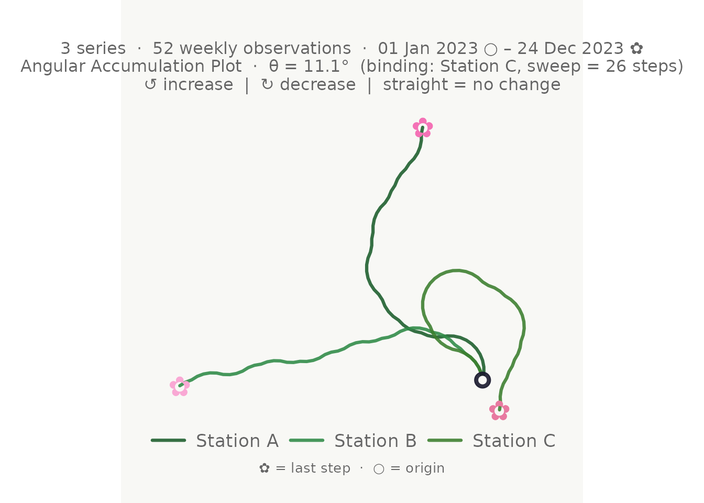
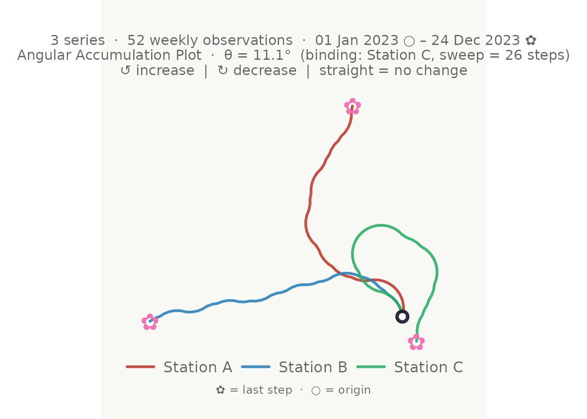
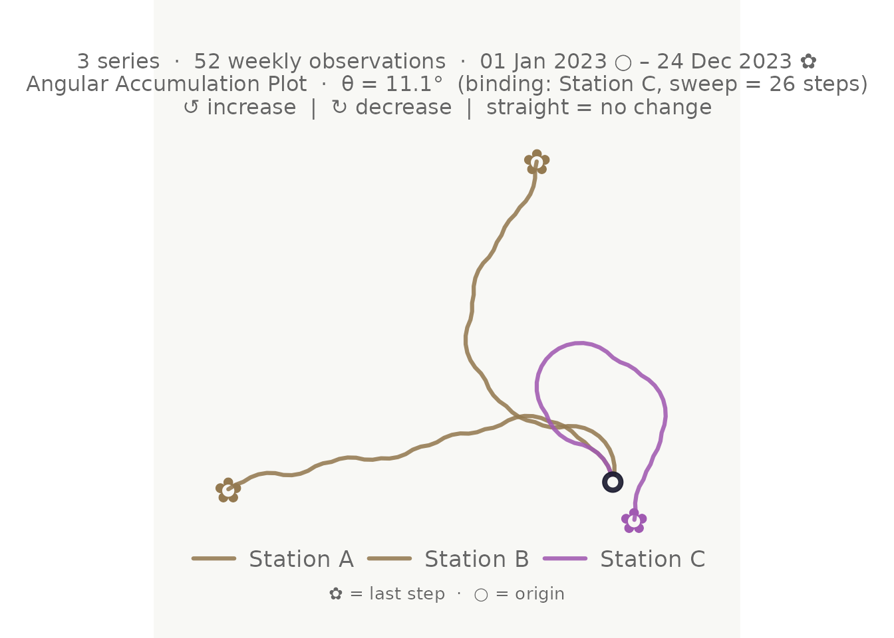
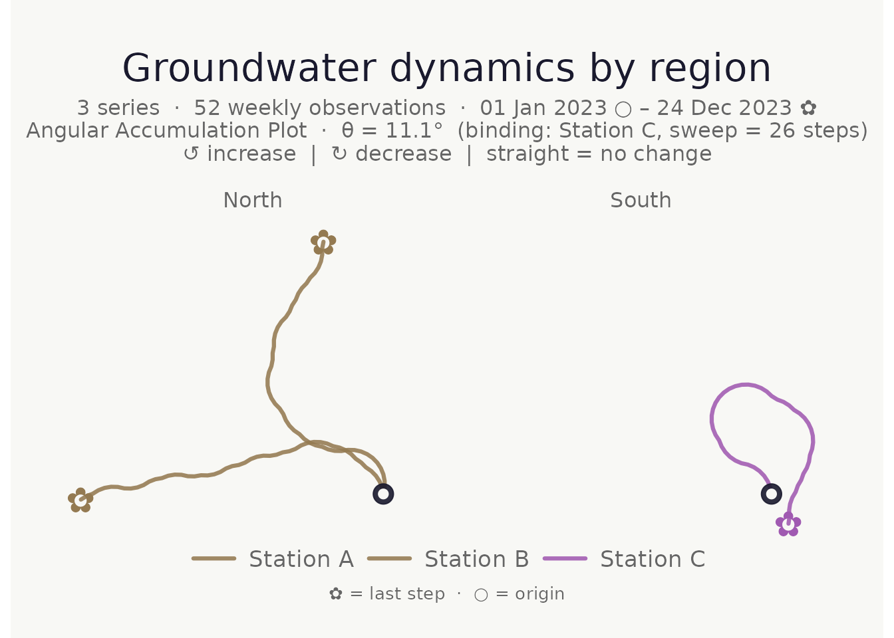
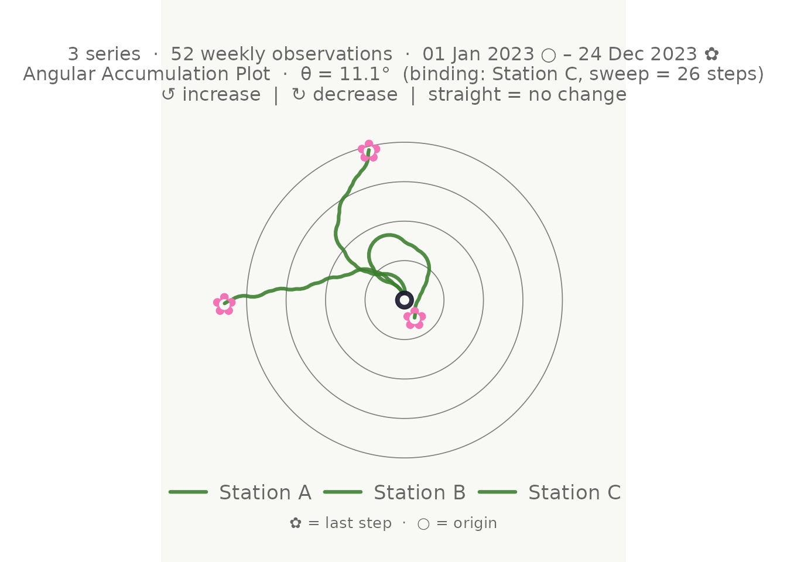
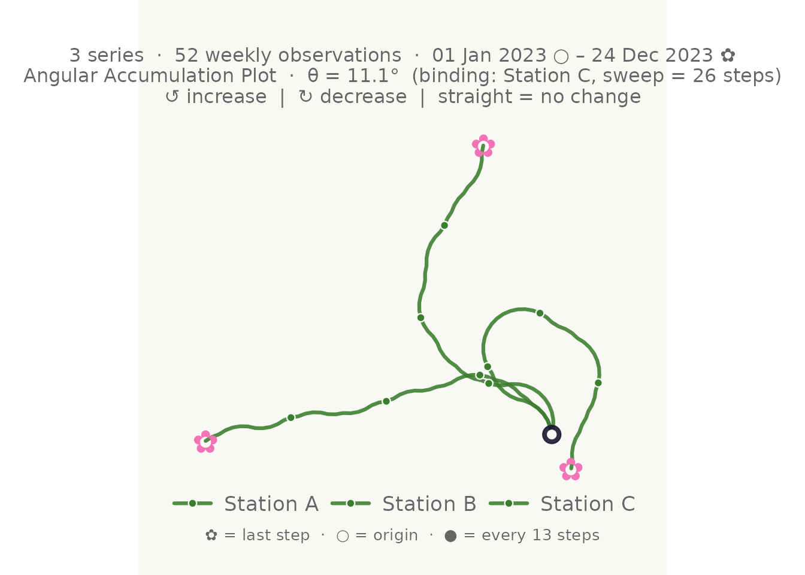
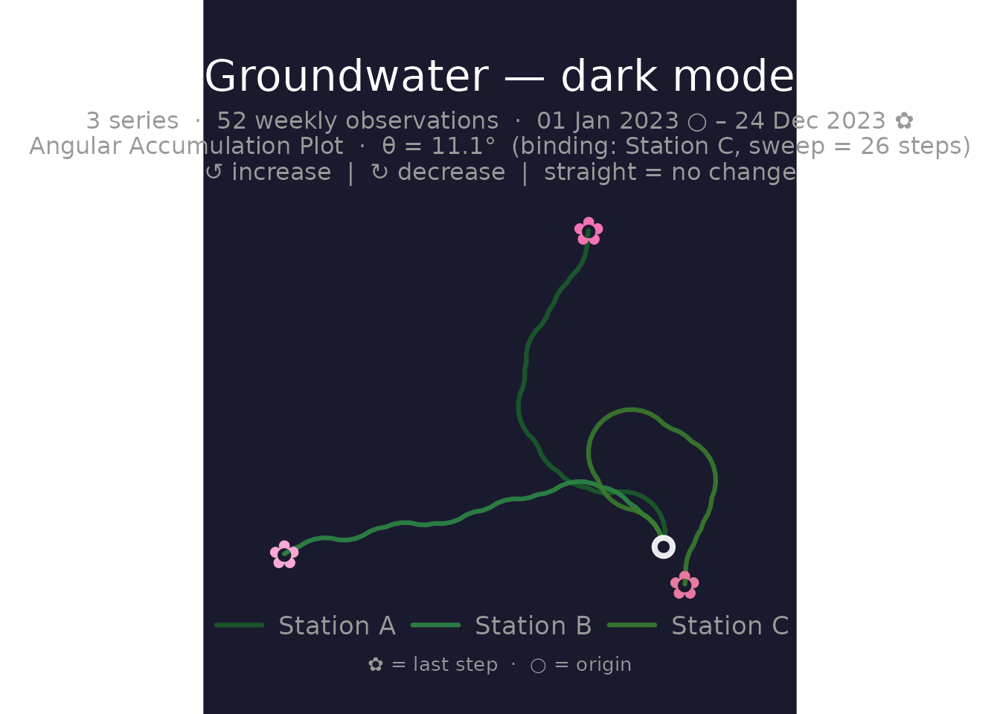
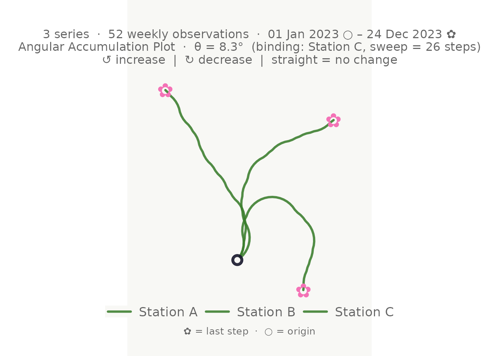
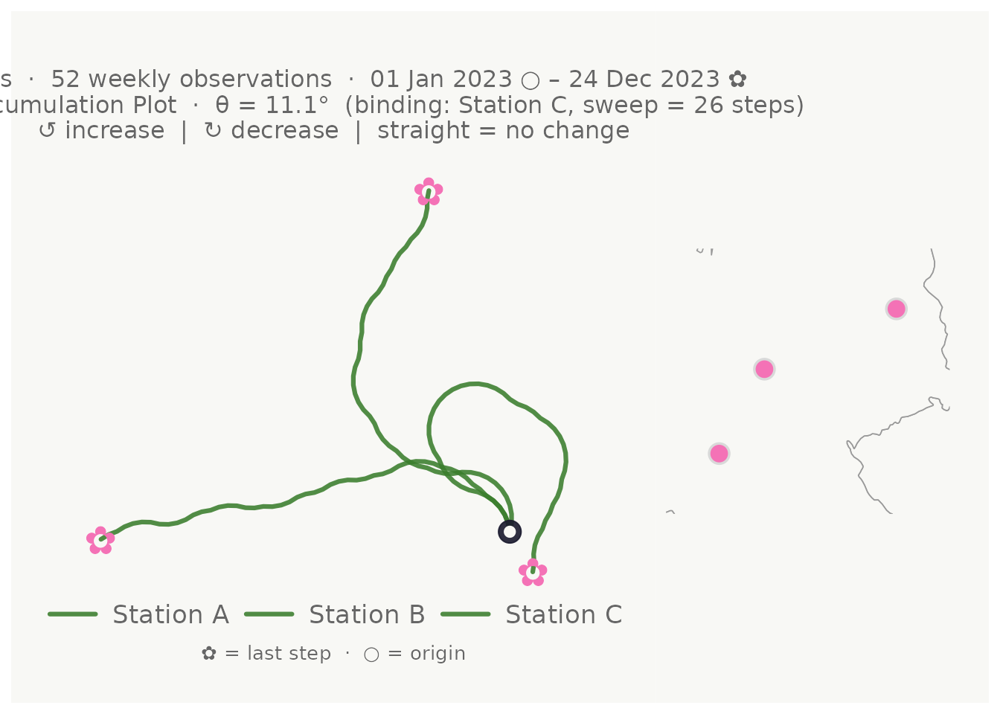

# Getting started with bouquets

## What is a bouquet plot?

A **bouquet plot** (also called an angular accumulation plot) converts
the directional dynamics of a time series into a 2-D turtle-graphics
path:

- Each **increase** turns the heading left by a fixed angle $\theta$.
- Each **decrease** turns it right by $\theta$.
- No change keeps the heading straight.

All series share the same origin and angle, so paths that look alike
come from series with similar up/down patterns — not necessarily similar
values. The technique is structurally related to DNA walk visualisations
(Gates 1986).

## Minimal example

``` r
set.seed(42)
n      <- 52L
weeks  <- seq(as.Date("2023-01-01"), by = "week", length.out = n)
season <- sin(seq(0, 2 * pi, length.out = n))

gw_long <- tibble::tibble(
  week    = rep(weeks, 3L),
  station = rep(c("Station A", "Station B", "Station C"), each = n),
  region  = rep(c("North", "North", "South"), each = n),
  level_m = c(
    8.5 + 0.8 * season + cumsum(rnorm(n,  0.00, 0.18)),
    7.2 + 0.5 * season + cumsum(rnorm(n,  0.02, 0.22)),
    9.1 + 1.1 * season + cumsum(rnorm(n, -0.01, 0.15))
  )
)

make_plot_bouquet(gw_long,
  time_col   = week,
  series_col = station,
  value_col  = level_m,
  verbose    = FALSE
)
```


Column order defaults make the call even shorter when your data is
already in the right column order:
`make_plot_bouquet(gw_long, verbose = FALSE)`.

------------------------------------------------------------------------

## Colour modes

Both `stem_colors` (the path lines) and `flower_colors` (the ✿ end
markers) accept four different types of input.

### 1 — Single hex colour

``` r
make_plot_bouquet(gw_long,
  time_col      = week,
  series_col    = station,
  value_col     = level_m,
  stem_colors   = "#2d6a9f",
  flower_colors = "#e07b39",
  verbose       = FALSE
)
```



### 2 — Named keywords

`"greens"` and `"blossom"` select curated palettes:

``` r
make_plot_bouquet(gw_long,
  time_col      = week,
  series_col    = station,
  value_col     = level_m,
  stem_colors   = "greens",
  flower_colors = "blossom",
  verbose       = FALSE
)
```



### 3 — Vector of hex colours (one per series)

``` r
make_plot_bouquet(gw_long,
  time_col      = week,
  series_col    = station,
  value_col     = level_m,
  stem_colors   = c("#c0392b", "#2980b9", "#27ae60"),
  verbose       = FALSE
)
```



### 4 — Column reference

Pass a bare column name. Each unique value in that column gets a
distinct perceptually uniform colour (via
[`hues::iwanthue()`](https://rdrr.io/pkg/hues/man/iwanthue.html)):

``` r
make_plot_bouquet(gw_long,
  time_col      = week,
  series_col    = station,
  value_col     = level_m,
  stem_colors   = region,
  flower_colors = region,
  verbose       = FALSE
)
```



------------------------------------------------------------------------

## Faceting

`facet_by` accepts any column name and splits the plot via
[`ggplot2::facet_wrap()`](https://ggplot2.tidyverse.org/reference/facet_wrap.html):

``` r
make_plot_bouquet(gw_long,
  time_col      = week,
  series_col    = station,
  value_col     = level_m,
  stem_colors   = region,
  flower_colors = region,
  facet_by      = region,
  title         = "Groundwater dynamics by region",
  verbose       = FALSE
)
```



------------------------------------------------------------------------

## Visual options

### Reference rings

`show_rings = TRUE` adds faint concentric circles at fixed radii to aid
distance judgements:

``` r
make_plot_bouquet(gw_long,
  time_col   = week,
  series_col = station,
  value_col  = level_m,
  show_rings = TRUE,
  verbose    = FALSE
)
```



### Step markers

`marker_every` places a dot at every N-th step, useful for reading
temporal progress:

``` r
make_plot_bouquet(gw_long,
  time_col     = week,
  series_col   = station,
  value_col    = level_m,
  marker_every = 13L,   # quarterly for weekly data
  verbose      = FALSE
)
```



### Dark mode

``` r
make_plot_bouquet(gw_long,
  time_col      = week,
  series_col    = station,
  value_col     = level_m,
  stem_colors   = "greens",
  flower_colors = "blossom",
  dark_mode     = TRUE,
  title         = "Groundwater — dark mode",
  verbose       = FALSE
)
```



### Launch direction and ceiling percentage

`launch_deg` sets the initial heading (90° = upward, the default).
`ceiling_pct` controls how tight the turns are: values close to 1 make
turns pronounced; smaller values leave more headroom before a loop would
occur.

``` r
make_plot_bouquet(gw_long,
  time_col    = week,
  series_col  = station,
  value_col   = level_m,
  launch_deg  = 45,
  ceiling_pct = 0.60,
  verbose     = FALSE
)
```



------------------------------------------------------------------------

## Clustering with `cluster_bouquet()`

[`cluster_bouquet()`](https://mxnl.github.io/bouquets/reference/cluster_bouquet.md)
groups series by the similarity of their directional sequences and
appends a `cluster` factor column. The result plugs directly into
[`make_plot_bouquet()`](https://mxnl.github.io/bouquets/reference/make_plot_bouquet.md).

``` r
set.seed(42)
n_big  <- 52L
weeks  <- seq(as.Date("2023-01-01"), by = "week", length.out = n_big)
season <- sin(seq(0, 2 * pi, length.out = n_big))

gw6 <- tibble::tibble(
  week    = rep(weeks, 6L),
  station = rep(paste0("S", 1:6), each = n_big),
  level_m = c(
    8.5 + 0.8 * season + cumsum(rnorm(n_big,  0.00, 0.2)),
    8.3 + 0.7 * season + cumsum(rnorm(n_big,  0.01, 0.2)),
    7.2 + 0.5 * season + cumsum(rnorm(n_big,  0.02, 0.2)),
    7.0 + 0.6 * season + cumsum(rnorm(n_big,  0.00, 0.2)),
    9.1 + 1.1 * season + cumsum(rnorm(n_big, -0.01, 0.2)),
    9.3 + 1.0 * season + cumsum(rnorm(n_big, -0.02, 0.2))
  )
)

clustered <- cluster_bouquet(gw6,
  time_col   = week,
  series_col = station,
  value_col  = level_m,
  verbose    = FALSE
)

dplyr::distinct(clustered, station, cluster)
#> # A tibble: 6 × 2
#>   station cluster
#>   <chr>   <fct>  
#> 1 S1      C1     
#> 2 S2      C3     
#> 3 S3      C2     
#> 4 S4      C1     
#> 5 S5      C4     
#> 6 S6      C2
```

Colour and facet the bouquet by cluster in one pipe:

``` r
clustered |>
  make_plot_bouquet(
    time_col      = week,
    series_col    = station,
    value_col     = level_m,
    stem_colors   = cluster,
    flower_colors = cluster,
    facet_by      = cluster,
    title         = "Series grouped by directional dynamics",
    verbose       = FALSE
  )
```


### Clustering methods

Five algorithms are available via the `method` argument:

| Method         | Description                                                             |
|----------------|-------------------------------------------------------------------------|
| `"pca_hclust"` | **(default)** PCA compression + Ward’s D2 hclust. Best for long series. |
| `"pca_kmeans"` | PCA + k-means. Faster for many series.                                  |
| `"hclust"`     | Ward’s D2 directly on direction sequences. Good for short series.       |
| `"kmeans"`     | k-means on raw sequences.                                               |
| `"pam"`        | Partitioning Around Medoids. Cluster centres are real observed series.  |

The `distance` argument (`"euclidean"`, `"correlation"`, `"manhattan"`)
applies to `"hclust"` and `"pam"`. Correlation distance measures whether
two series **co-move** regardless of amplitude, which is often the most
meaningful choice for hydrological data:

``` r
cluster_bouquet(gw6,
  time_col   = week,
  series_col = station,
  value_col  = level_m,
  method     = "hclust",
  distance   = "correlation",
  verbose    = FALSE
) |>
  dplyr::distinct(station, cluster)
#> # A tibble: 6 × 2
#>   station cluster
#>   <chr>   <fct>  
#> 1 S1      C1     
#> 2 S2      C3     
#> 3 S3      C2     
#> 4 S4      C1     
#> 5 S5      C4     
#> 6 S6      C2
```

### Automatic k selection

When `k = "auto"` (default), the function fits the model for
$k = 2,\ldots,k_{\text{max}}$ and selects the k that maximises:

$$\text{score}(k) = \bar{s}(k) \times \min\limits_{c}{\bar{s}}_{c}(k) \times k^{\text{resolution}}$$

The worst-cluster term $\min_{c}{\bar{s}}_{c}(k)$ prevents choosing a k
where any one cluster is poorly defined. The `resolution` exponent
rewards finer groupings while they remain well-separated. Increase it to
push toward more clusters:

``` r
cluster_bouquet(gw6,
  time_col   = week,
  series_col = station,
  value_col  = level_m,
  resolution = 1.5,
  verbose    = FALSE
) |>
  dplyr::distinct(station, cluster)
#> # A tibble: 6 × 2
#>   station cluster
#>   <chr>   <fct>  
#> 1 S1      C1     
#> 2 S2      C3     
#> 3 S3      C2     
#> 4 S4      C1     
#> 5 S5      C4     
#> 6 S6      C2
```

Fix k directly when you already know how many groups you need:

``` r
cluster_bouquet(gw6,
  time_col   = week,
  series_col = station,
  value_col  = level_m,
  k          = 2L,
  verbose    = FALSE
) |>
  dplyr::distinct(station, cluster)
#> # A tibble: 6 × 2
#>   station cluster
#>   <chr>   <fct>  
#> 1 S1      C2     
#> 2 S2      C1     
#> 3 S3      C1     
#> 4 S4      C2     
#> 5 S5      C1     
#> 6 S6      C1
```

------------------------------------------------------------------------

## Location map panel

When coordinate columns are supplied,
[`make_plot_bouquet()`](https://mxnl.github.io/bouquets/reference/make_plot_bouquet.md)
attaches a location map to the right of the bouquet. Points are coloured
to match the flower markers. The map background is drawn from the `maps`
package (country outlines) or `mapdata` (sub-national boundaries) if
installed.

Coordinates in WGS84 decimal degrees work directly. For projected
coordinates supply the EPSG code via `coord_crs`:

``` r
# Example with decimal-degree coordinates
gw_coords <- dplyr::mutate(gw_long,
  lon = c(rep(9.9, n), rep(13.4, n), rep(8.7, n)),
  lat = c(rep(51.5, n), rep(52.5, n), rep(50.1, n))
)

make_plot_bouquet(gw_coords,
  time_col   = week,
  series_col = station,
  value_col  = level_m,
  lon_col    = lon,
  lat_col    = lat,
  map_width  = 0.35,
  verbose    = FALSE
)
```



`map_width` controls the relative width of the map panel (default `0.35`
= 35 % of the combined figure width). The map is automatically zoomed
and padded around the point locations, and works for any country or
region.

------------------------------------------------------------------------

## Combining everything

``` r
  cluster_bouquet(
    time_col   = date,
    series_col = well_id,
    value_col  = gwl,
    method     = "pca_hclust",
    distance   = "euclidean",
    resolution = 0.8
  ) |>
  make_plot_bouquet(
    time_col      = date,
    series_col    = well_id,
    value_col     = gwl,
    stem_colors   = cluster,
    flower_colors = cluster,
    facet_by      = cluster,
    lon_col       = easting,
    lat_col       = northing,
    coord_crs     = 3035,
    show_rings    = TRUE,
    dark_mode     = TRUE,
    title         = "Groundwater dynamics by directional cluster",
    verbose       = FALSE
  )
```
