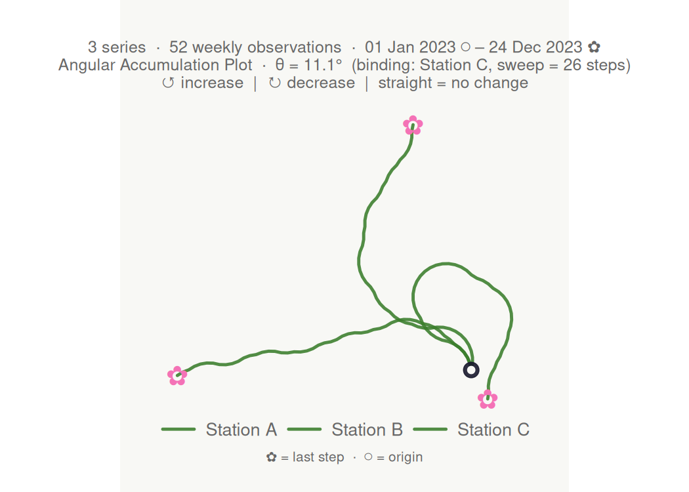
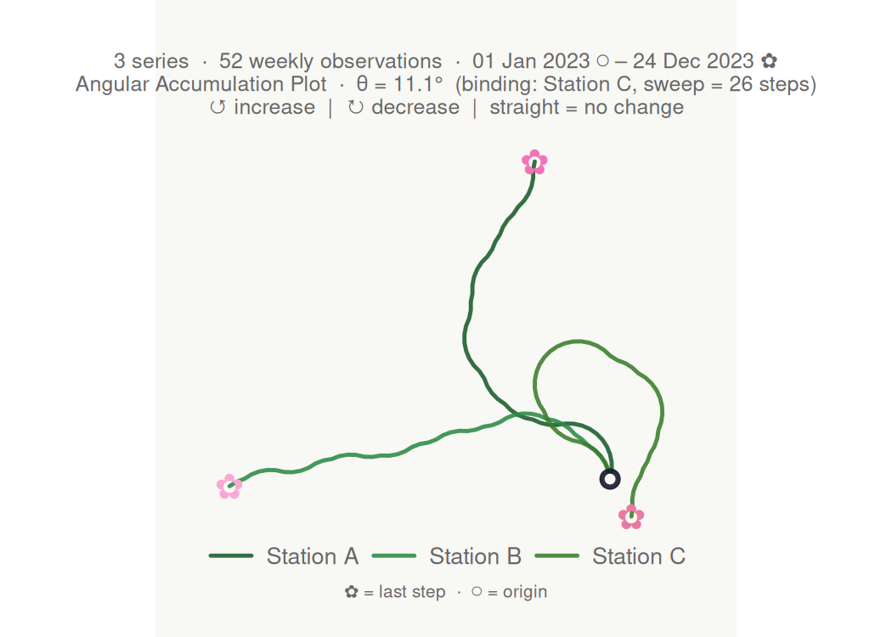
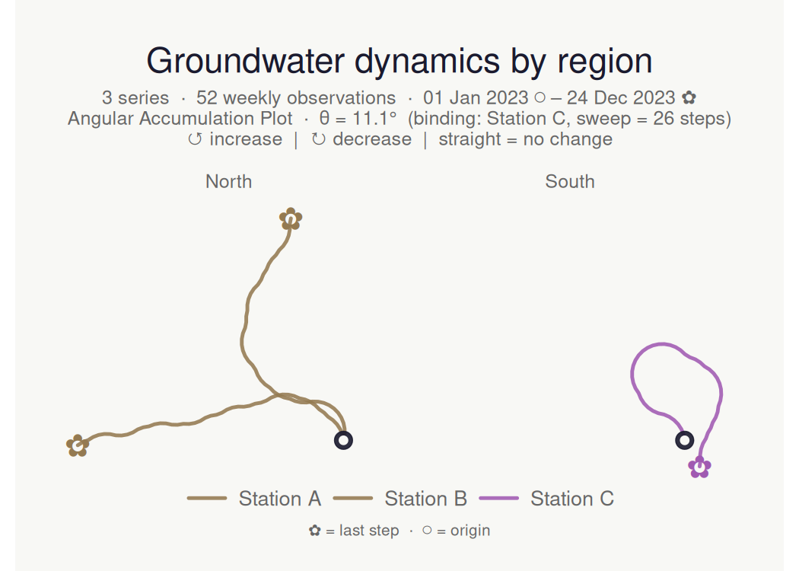
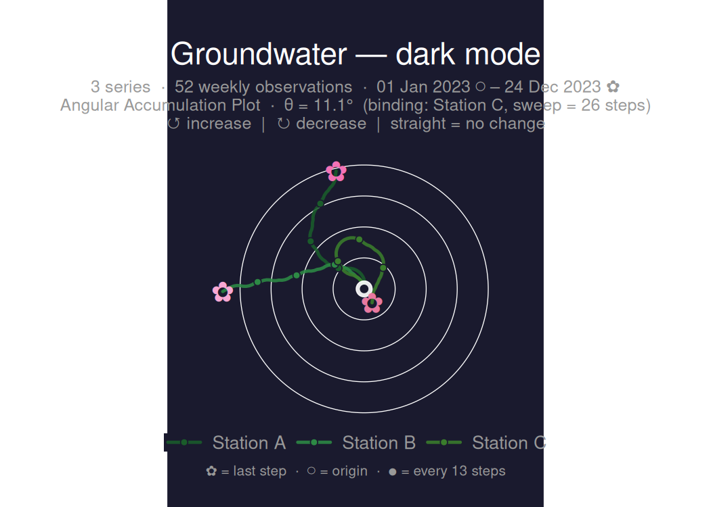
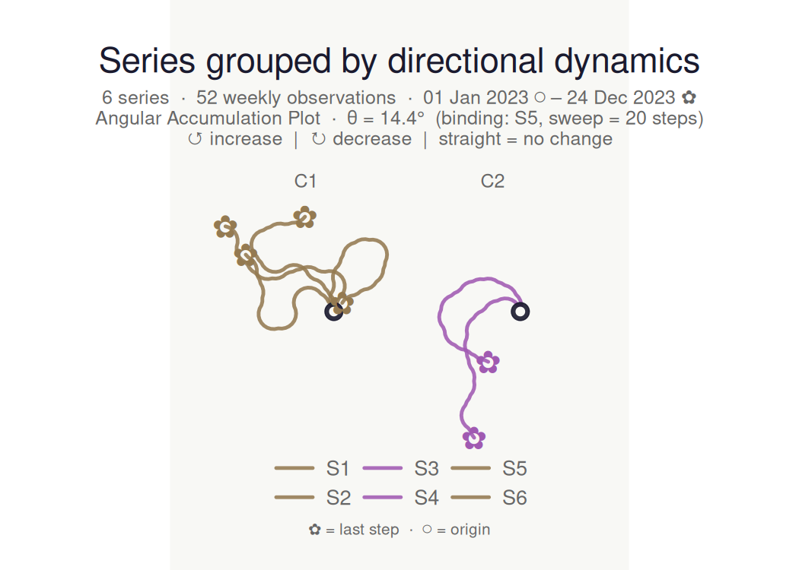
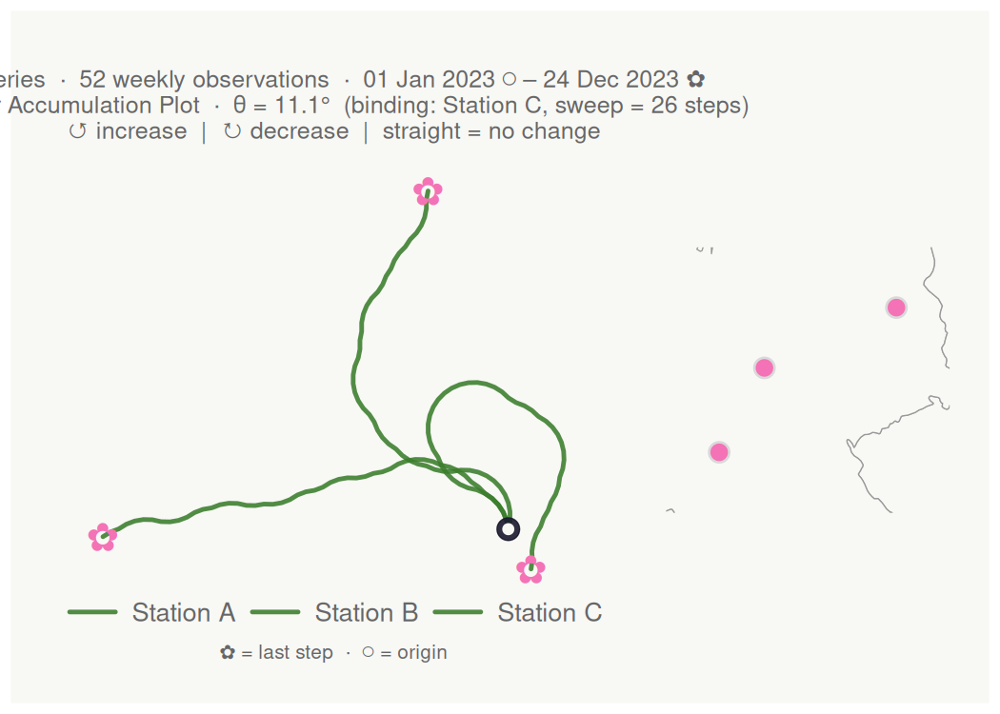

# bouquets 

**bouquets** creates angular accumulation plots for collections of time
series. Each series is encoded as a turtle-graphics path that turns
**left** on increases and **right** on decreases — all series share the
same origin and turning angle, so paths that look alike come from series
with similar directional dynamics, regardless of their absolute values.

The technique is structurally related to DNA walk visualisations (Gates
1986; Yau et al. 2003).

------------------------------------------------------------------------

## Installation

``` r
# Development version from GitHub
# install.packages("remotes")
remotes::install_github("YOUR_GITHUB_USERNAME/bouquets")
```

Optional dependencies that unlock extra features:

| Package     | Feature                                    |
|-------------|--------------------------------------------|
| `patchwork` | Location map panel (`lon_col` + `lat_col`) |
| `maps`      | Map background (required for map panel)    |
| `mapdata`   | Sub-national boundaries on the map         |
| `sf`        | Reprojection of non-WGS84 coordinates      |

------------------------------------------------------------------------

## Basic usage

``` r
n      <- 52L
weeks  <- seq(as.Date("2023-01-01"), by = "week", length.out = n)
season <- sin(seq(0, 2 * pi, length.out = n))

gw_long <- tibble::tibble(
  week    = rep(weeks, 3L),
  station = rep(c("Station A", "Station B", "Station C"), each = n),
  region  = rep(c("North", "North", "South"), each = n),
  level_m = c(
    8.5 + 0.8 * season + cumsum(rnorm(n,  0.00, 0.18)),
    7.2 + 0.5 * season + cumsum(rnorm(n,  0.02, 0.22)),
    9.1 + 1.1 * season + cumsum(rnorm(n, -0.01, 0.15))
  )
)

make_plot_bouquet(gw_long,
  time_col   = week,
  series_col = station,
  value_col  = level_m,
  verbose    = FALSE
)
```



------------------------------------------------------------------------

## Key features

### Keyword colour palettes

``` r
make_plot_bouquet(gw_long,
  time_col      = week,
  series_col    = station,
  value_col     = level_m,
  stem_colors   = "greens",
  flower_colors = "blossom",
  verbose       = FALSE
)
```



### Column-driven colours and faceting

Pass a bare column name to colour series by a grouping variable, and
split into facets with `facet_by`:

``` r
make_plot_bouquet(gw_long,
  time_col      = week,
  series_col    = station,
  value_col     = level_m,
  stem_colors   = region,
  flower_colors = region,
  facet_by      = region,
  title         = "Groundwater dynamics by region",
  verbose       = FALSE
)
```



### Dark mode with rings and step markers

``` r
make_plot_bouquet(gw_long,
  time_col      = week,
  series_col    = station,
  value_col     = level_m,
  stem_colors   = "greens",
  flower_colors = "blossom",
  show_rings    = TRUE,
  marker_every  = 13L,
  dark_mode     = TRUE,
  title         = "Groundwater — dark mode",
  verbose       = FALSE
)
```



### Clustering

[`cluster_bouquet()`](https://mxnl.github.io/bouquets/reference/cluster_bouquet.md)
groups series by the similarity of their directional sequences and
appends a `cluster` column that plugs directly into
[`make_plot_bouquet()`](https://mxnl.github.io/bouquets/reference/make_plot_bouquet.md):

``` r
set.seed(7)
n2     <- 52L
sea2   <- sin(seq(0, 2 * pi, length.out = n2))
wks2   <- seq(as.Date("2023-01-01"), by = "week", length.out = n2)

gw6 <- tibble::tibble(
  week    = rep(wks2, 6L),
  station = rep(paste0("S", 1:6), each = n2),
  level_m = c(
    8.5 + 0.8 * sea2 + cumsum(rnorm(n2,  0.00, 0.2)),
    8.3 + 0.7 * sea2 + cumsum(rnorm(n2,  0.01, 0.2)),
    7.2 + 0.5 * sea2 + cumsum(rnorm(n2,  0.02, 0.2)),
    7.0 + 0.6 * sea2 + cumsum(rnorm(n2,  0.00, 0.2)),
    9.1 + 1.1 * sea2 + cumsum(rnorm(n2, -0.01, 0.2)),
    9.3 + 1.0 * sea2 + cumsum(rnorm(n2, -0.02, 0.2))
  )
)

gw6 |>
  cluster_bouquet(
    time_col   = week,
    series_col = station,
    value_col  = level_m,
    verbose    = FALSE
  ) |>
  make_plot_bouquet(
    time_col      = week,
    series_col    = station,
    value_col     = level_m,
    stem_colors   = cluster,
    flower_colors = cluster,
    facet_by      = cluster,
    title         = "Series grouped by directional dynamics",
    verbose       = FALSE
  )
```



### Location map panel

Supply coordinate columns to attach a location map alongside the
bouquet. Any projected CRS is handled via `coord_crs`
(e.g. `coord_crs = 3035` for ETRS89-LAEA).

``` r
gw_coords <- dplyr::mutate(gw_long,
  lon = c(rep(9.9, n), rep(13.4, n), rep(8.7, n)),
  lat = c(rep(51.5, n), rep(52.5, n), rep(50.1, n))
)

make_plot_bouquet(gw_coords,
  time_col   = week,
  series_col = station,
  value_col  = level_m,
  lon_col    = lon,
  lat_col    = lat,
  map_width  = 0.35,
  verbose    = FALSE
)
```



------------------------------------------------------------------------

## How it works

For each series, the signed first difference is binarised to +1
(increase), −1 (decrease), or 0 (no change). The heading at step *i* is:

$$h_{i} = h_{\text{launch}} + \sum\limits_{k = 2}^{i}d_{k} \cdot \theta$$

The angle θ is derived so that even the most volatile series in the
dataset never completes a full loop:

$$\theta = \frac{360{^\circ}}{\max\limits_{s}\left( \max C_{s} - \min C_{s} \right)} \times \texttt{𝚌𝚎𝚒𝚕𝚒𝚗𝚐\_𝚙𝚌𝚝}$$

where *C*ₛ is the cumulative sum of signed steps for series *s*. All
coordinates follow as a vectorised `cumsum(cos(heading))` /
`cumsum(sin(heading))`.

------------------------------------------------------------------------

## Citation

If you use bouquets in a publication, please cite it as:

``` R
Last, F. (2025). bouquets: Angular accumulation plots for time series.
R package version 0.1.0. https://github.com/YOUR_GITHUB_USERNAME/bouquets
```

------------------------------------------------------------------------

## References

Gates, M. A. (1986). A simple way to look at DNA. *Journal of
Theoretical Biology*, 119(3), 319–328.

Yau, S. S.-T., et al. (2003). DNA sequence representation without
degeneracy. *Nucleic Acids Research*, 31(12), 3078–3080.
